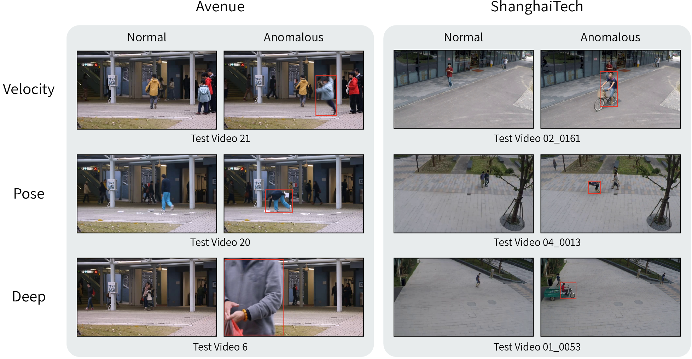

## Interpretable_VAD
Official Implementation of "Attribute-based Representations for Accurate and Interpretable Video Anomaly Detection".

[\[arXiv\]]()



## 1. Dependencies
```
python==3.7
torch==1.12.0+cu102
```

## 2. Usage
### 2.1 Data download and Preparation
To download the evaluation datasets, please follow the [instructions](./data/README.md).

### 2.2 Data preparation
The training and testing datasets should be preprocessed according to the these [instructions](./pre_processing/README.md).

### 2.3 Feature Extraction
For extracting velocity and deep representations, run the following command:

```
python feature_extraction.py [--dataset_name]
```

Pose representations have already been provided by us.

### 2.4 Score calibration
To compute calibration parameters for each representation, run the following command:
```
python score_calibration.py [--dataset_name]
```
### 2.4 Evaluation
Finally, you can evaluate by running the following command:
```
python evaluate.py [--dataset_name]
```

You can download our set of representations for Ped2, Avenue and ShanghaiTech datasets from [here](https://drive.google.com/drive/folders/1vSMpDb5jIyc2tNJaYVphguUlFcwPayms?usp=sharing).

## 3. Results

|     Model      | UCSD Ped2 | CUHK Avenue | ShanghaiTech |
| :------------: |:---------:|:-----------:|:------------:|
|    HF2-VAD     |   99.1%   |    93.3%    |    85.9%     |


## Citation
If you find this useful, please cite our paper:
```

```
